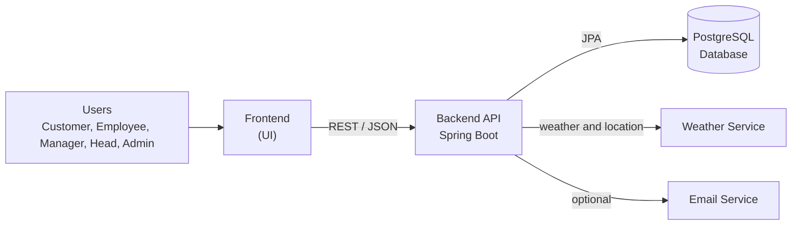
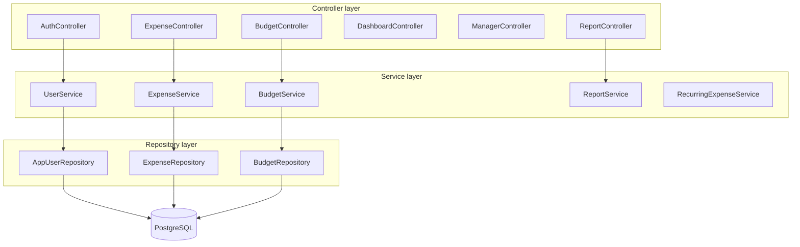

# EXPENSIFY

Expensify is a robust, full-stack expense tracking and budget alert system designed for enterprise-grade security and scalability. Users can record expenses, set budgets, and receive automated notifications as they approach limits. The system supports hierarchical management, enabling Managers to oversee customers and Admins to broadcast payment-disruption alerts.

This README covers the core project components:

| Part | What it does | Where it lives |
|------|--------------|----------------|
| **Backend** | Java / Spring Boot REST API providing core business logic, security, and reporting | `backend/` directory |
| **Frontend** | React-based user interface consuming the backend API | `frontend/` directory |
| **Database** | PostgreSQL schema defining strict data contracts | `DATABASE_CONTRACT.md` |

## Table of Contents

- [Architecture](#architecture)
- [Enterprise Features & Security](#enterprise-features--security)
- [Backend](#backend)
- [Frontend](#frontend)
- [Running the Application](#running-the-application)

---

## Architecture

### High-level system architecture



### Backend layered architecture



---

## Enterprise Features & Security

The system has been hardened against common vulnerabilities and expanded with enterprise features:

* **Authentication & Authorization**: Stateless JWT (JSON Web Tokens) with refresh mechanisms. Strict Role-Based Access Control (RBAC) ensuring endpoints are protected based on user roles (`CUSTOMER`, `MANAGER`, `ADMIN`).
* **Vulnerability Mitigation**: Robust protection against Insecure Direct Object References (IDOR). All resource access (expenses, profiles, reports) is strictly validated against the authenticated user's ID.
* **Rate Limiting**: Critical endpoints (e.g., login) are protected against brute-force attacks.
* **Data Privacy**: Sensitive user data is omitted from API responses via secure DTO mapping.
* **Expense Management & Reporting**: 
  * Advanced expense categorization (`ExpenseCategory`) and payment tracking (`ExpensePaymentMethod`).
  * Automated **Recurring Expenses** (daily, weekly, monthly, yearly) powered by Spring Scheduling.
  * PDF and CSV **Report Generation** for audit trails and financial summaries.

---

## Backend

The backend is built with Java 21, Spring Boot, Spring Data JPA, and PostgreSQL. 

### Core Dependencies
- **jjwt**: Secure JWT generation and validation.
- **OpenPDF**: In-memory PDF report generation.
- **Spring Boot Starter Security**: Core security interceptors and RBAC.

### Run the backend

1. Ensure Java 21 and Maven are installed.
2. Configure PostgreSQL credentials via environment variables (`DB_URL`, `DB_USERNAME`, `DB_PASSWORD`).
3. Start the server from the `backend/` directory:

```bash
cd backend
mvn spring-boot:run
```
Backend URL: `http://localhost:8080`
Health check: `GET /api/health`

---

## Frontend

The frontend is a modern web application designed to consume the backend's REST APIs securely.

### Run the frontend

1. Ensure Node.js is installed.
2. Navigate to the frontend directory:
```bash
cd frontend
npm install
npm start
```
Frontend URL: `http://localhost:3000`

---

## Running the Whole Project

1. Set up the **PostgreSQL database** as defined in `DATABASE_CONTRACT.md`.
2. Start the **backend** via Maven.
3. Start the **frontend** via npm.
4. Ensure cross-origin resource sharing (CORS) is configured correctly if running on different ports locally.

> Note: Never commit sensitive credentials to source control. Always utilize `.env` files or system environment variables.
