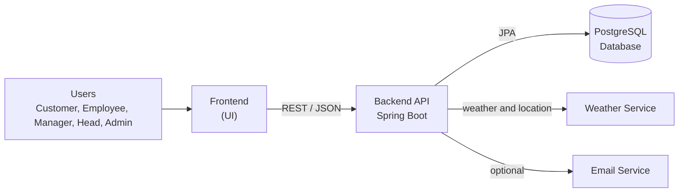
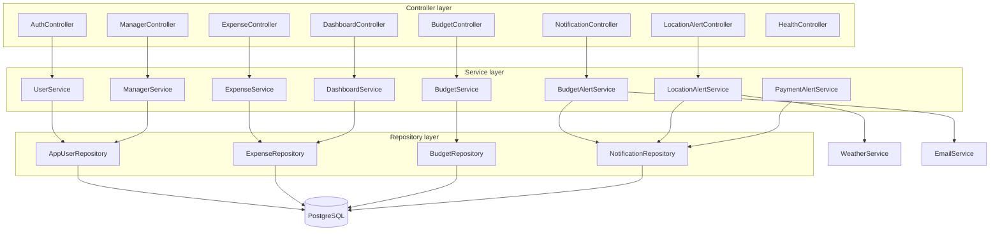
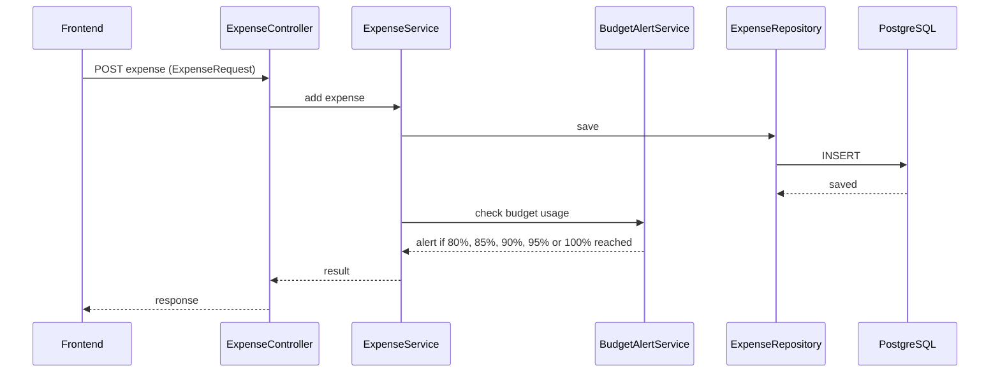
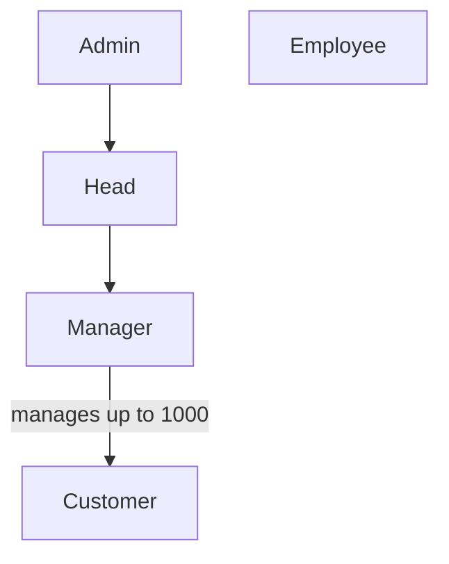

# EXPENSIFY

A full-stack expense tracking and budget alert system. Users record expenses, set budgets, and get notified as they approach their limits. Managers can oversee their customers, and admins can push payment-disruption alerts.

This README covers all three parts of the project:

| Part | What it does | Where it lives |
|------|--------------|----------------|
| **Backend** | Java / Spring Boot REST API with all the business logic | This repository |
| **Database** | PostgreSQL schema used by the backend | `DATABASE_CONTRACT.md` |
| **Frontend** | User interface that calls the backend API | _Add your frontend repo link here_ |

## Table of Contents

- [Architecture](#architecture)
- [Backend](#backend)
- [Database](#database)
- [Frontend](#frontend)
- [Running the Whole Project](#running-the-whole-project)
- [Deployment](#deployment)
- [Team and Contracts](#team-and-contracts)

## Architecture

### High-level system architecture



### Backend layered architecture



| Layer | Responsibility |
|-------|----------------|
| **Controller** | Receives requests from the frontend and returns responses |
| **Service** | Contains the business logic |
| **Repository** | Talks to the database |
| **Model** | Represents a database table |

> The controller receives the request, the service does the work, the repository communicates with the database, and the model represents the table.

### Request flow example: adding an expense



### Roles



The role hierarchy above is a simplified view of `UserRole`. Check `UserRole.java` and `TEAM_API_CONTRACT.md` for the exact permissions.

---

## Backend

A simple Java / Spring Boot backend, written so a beginner can follow the main logic.

### Features

- Register and login for Customer, Employee, Manager, Head and Admin roles
- Add, view and delete expenses
- Daily, weekly, monthly and yearly budgets
- Change a budget limit only after password verification
- Budget alerts at 80%, 85%, 90%, 95% and 100% of the limit
- Manager can manage up to 1000 customers
- Dashboard data for daily and monthly charts
- Weather and location alert integration
- Payment-disruption alerts, added through an admin endpoint
- Optional email alerts
- Docker and Render deployment files

### Tech stack

Java 21, Spring Boot, Spring Data JPA, Maven, PostgreSQL, Docker.

### Code layout

| Area | Files |
|------|-------|
| Controllers | `AuthController`, `ExpenseController`, `BudgetController`, `DashboardController`, `ManagerController`, `NotificationController`, `LocationAlertController`, `HealthController` |
| Services | `UserService`, `ExpenseService`, `BudgetService`, `BudgetAlertService`, `DashboardService`, `ManagerService`, `WeatherService`, `LocationAlertService`, `PaymentAlertService`, `EmailService` |
| Repositories | `AppUserRepository`, `ExpenseRepository`, `BudgetRepository`, `NotificationRepository` |
| Models and enums | `AppUser`, `Expense`, `Budget`, `Notification`, `UserRole`, `BudgetType`, `AlertType` |
| Request / response objects | `RegisterUserRequest`, `UserLoginRequest`, `ExpenseRequest`, `BudgetRequest`, `ChangeLimitRequest`, `LocationRequest`, `LoginResponse`, `LocationAlertResponse` |
| Config and errors | `CorsConfig`, `GlobalExceptionHandler`, `application.properties` |
| Entry point | `ExpensifyApplication` |

### Run the backend

1. Install Java 21 and Maven.
2. Put your PostgreSQL values in environment variables or a `.env` file.
3. Make sure the database tables match `DATABASE_CONTRACT.md`.
4. Start the server:

```bash
mvn spring-boot:run
```

- Backend URL: `http://localhost:8080`
- Health check: `GET /api/health`

---

## Database

The backend uses **PostgreSQL**. The database and its tables are created and managed separately by the database teammate.

The backend runs with:

```
spring.jpa.hibernate.ddl-auto=validate
```

So it only **checks** that the database matches the Java models. It does not create or change tables. If a table or column is missing, the app will fail to start.

### Main tables

Each Java model maps to one table:

| Model | Stores |
|-------|--------|
| `AppUser` | Users and their role (Customer, Employee, Manager, Head, Admin) |
| `Expense` | Expenses added by users |
| `Budget` | Budgets by period (daily, weekly, monthly, yearly) with their limits |
| `Notification` | Alerts sent to users (budget, weather/location, payment disruption) |

The exact column names, types and constraints are defined in [`DATABASE_CONTRACT.md`](DATABASE_CONTRACT.md). That file is the source of truth.

### Database setup

1. Create a PostgreSQL database.
2. Create the tables following `DATABASE_CONTRACT.md`.
3. Set the connection values (URL, username, password) as environment variables.

---

## Frontend

> The frontend is not part of this repository. Fill in the details below for your frontend.

- **Repository:** _add link_
- **Framework / tech:** _for example React, Angular or plain HTML/CSS/JS_
- **Live demo:** _add link, if any_

### How the frontend talks to the backend

- All data comes from the backend REST API.
- The backend allows cross-origin requests through `CorsConfig`, so the frontend can run on a different port or domain.
- Set the backend base URL in the frontend config:
  - Local: `http://localhost:8080`
  - Deployed: your Render URL
- The endpoints and request/response formats are listed in [`TEAM_API_CONTRACT.md`](TEAM_API_CONTRACT.md).

### Main screens

| Screen | Uses |
|--------|------|
| Register / Login | `AuthController` |
| Expenses | `ExpenseController` |
| Budgets and limit change | `BudgetController` |
| Dashboard (daily and monthly charts) | `DashboardController` |
| Notifications and alerts | `NotificationController`, `LocationAlertController` |
| Manager panel | `ManagerController` |

### Run the frontend

_Add your steps here, for example `npm install` then `npm start`._

---

## Running the Whole Project

1. Set up the **database** and create the tables from `DATABASE_CONTRACT.md`.
2. Start the **backend** with `mvn spring-boot:run` and confirm `GET /api/health` works.
3. Start the **frontend** and point it at `http://localhost:8080`.

## Deployment

- **Docker:** build and run with the included `Dockerfile`.
- **Render:** deploy with the included `render.yaml`.

Never commit real passwords or API keys. Use environment variables.

## Team and Contracts

| File | Purpose |
|------|---------|
| [`DATABASE_CONTRACT.md`](DATABASE_CONTRACT.md) | Database schema the backend expects |
| [`TEAM_API_CONTRACT.md`](TEAM_API_CONTRACT.md) | API contract shared between backend and frontend |
