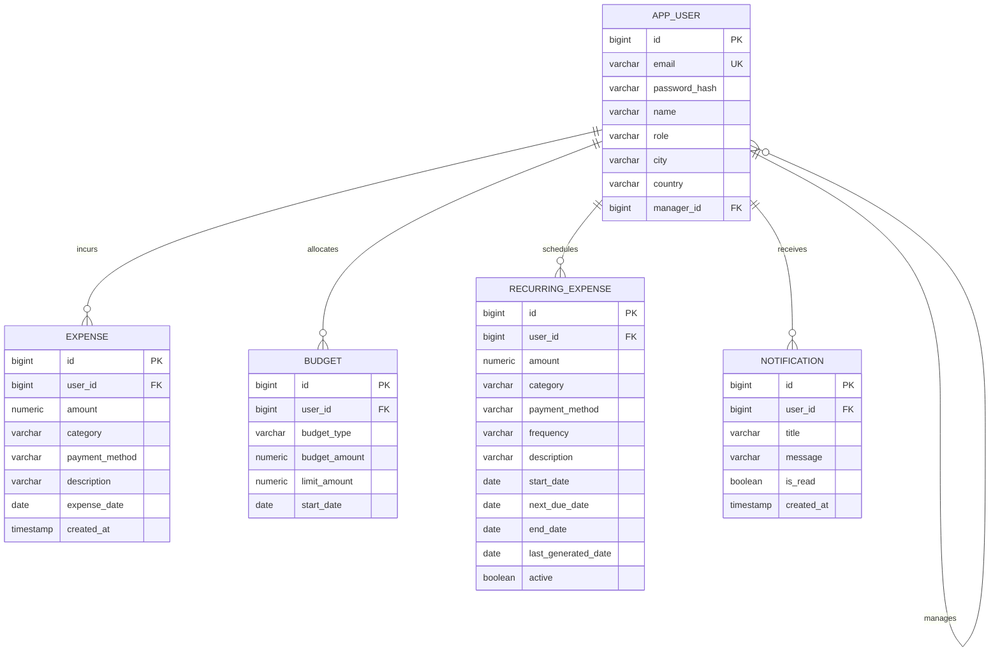

# EXPENSIFY – Smart Expense & Budget Management System

> EXPENSIFY is a full-stack expense and budget management system built with Java Spring Boot, PostgreSQL, JWT authentication and Next.js. It enables users to manage expenses, create budgets, analyze spending, generate financial reports, manage recurring expenses and receive budget alerts through role-based access control.

---

## 📌 Table of Contents
- [Overview](#overview)
- [Features](#features)
- [Java / Spring Boot Architecture](#java--spring-boot-architecture)
- [Technology Stack](#technology-stack)
- [OOP Concepts Used](#oop-concepts-used)
- [Database & ER Diagram](#database--er-diagram)
- [Role Hierarchy & Security](#role-hierarchy--security)
- [Authentication](#authentication)
- [Expense Categories](#expense-categories)
- [Payment Methods](#payment-methods)
- [Spending Analytics](#spending-analytics)
- [PDF & CSV Financial Reports](#pdf--csv-financial-reports)
- [Recurring Expenses Engine](#recurring-expenses-engine)
- [REST API Documentation](#rest-api-documentation)
- [Setup & Environment Variables](#setup--environment-variables)
- [Running Backend](#running-backend)
- [Running Frontend](#running-frontend)
- [Docker Deployment](#docker-deployment)
- [Testing Suite](#testing-suite)
- [Screenshots](#screenshots)

---

## 🌟 Overview
EXPENSIFY is an enterprise-grade financial management web application designed for individual and organizational expense tracking. All core business logic, relational data modeling, scheduled background recurring tasks, analytical aggregations, and report exports are engineered in a strict **Java 21 / Spring Boot 3** microservices architecture backed by **PostgreSQL**, with a dynamic **Next.js** frontend dashboard.

---

## 🚀 Features
1. **Expense Categories**: 11 robust categories (`FOOD`, `TRAVEL`, `SHOPPING`, `BILLS`, `ENTERTAINMENT`, `HEALTH`, `EDUCATION`, `RENT`, `GROCERIES`, `SUBSCRIPTIONS`, `OTHER`) enforced via Java Enums with `@Enumerated(EnumType.STRING)`.
2. **Payment Methods**: 7 payment modes (`CASH`, `UPI`, `CREDIT_CARD`, `DEBIT_CARD`, `BANK_TRANSFER`, `WALLET`, `OTHER`) tracked across all transactions.
3. **Spending Analytics**: Complete financial metrics calculated directly in Java using Spring Data JPA aggregations (`SUM`, `COUNT`, `GROUP BY`) avoiding in-memory bottlenecks.
4. **PDF / CSV Reports**: On-demand report downloads generated directly on the Java backend using OpenPDF (LGPL) and streaming CSV.
5. **Recurring Expenses Engine**: Scheduled background processor using Spring `@Scheduled` with strict duplicate execution prevention via `lastGeneratedDate` safeguards.
6. **Hierarchical Role-Based Access Control**: Multi-tiered role permission enforcement (`ADMIN` > `HEAD` > `MANAGER` > `EMPLOYEE` > `CUSTOMER`) with IDOR protections.
7. **Budget & Limit Tracking**: Real-time spending progress against daily, weekly, monthly, and yearly budgets.
8. **Threshold Alerts**: Automated budget notifications dispatched at 80%, 85%, 90%, 95%, and 100% of defined budget limits.

---

## 🏛️ Java / Spring Boot Architecture
The backend is structured into clean architectural layers adhering to separation of concerns and industry best practices:

```
src/main/java/com/expensify/backend/
├── controller/         # REST Controllers handling HTTP requests & mapping responses
│   ├── AnalyticsController.java
│   ├── AuthController.java
│   ├── BudgetController.java
│   ├── CustomerController.java
│   ├── DashboardController.java
│   ├── ExpenseController.java
│   ├── RecurringExpenseController.java
│   └── ReportController.java
├── service/            # Core business logic, computations & scheduled tasks
│   ├── AnalyticsService.java
│   ├── BudgetService.java
│   ├── ExpenseService.java
│   ├── JwtService.java
│   ├── RecurringExpenseService.java
│   ├── ReportService.java
│   ├── RoleHierarchyService.java
│   └── UserService.java
├── repository/         # Spring Data JPA interfaces with optimized JPQL queries
│   ├── AppUserRepository.java
│   ├── BudgetRepository.java
│   ├── ExpenseRepository.java
│   ├── NotificationRepository.java
│   └── RecurringExpenseRepository.java
├── model/              # Hibernate JPA Entities & Database Schema mappings
│   ├── AppUser.java
│   ├── Budget.java
│   ├── Expense.java
│   ├── Notification.java
│   └── RecurringExpense.java
├── dto/                # Request & Response Data Transfer Objects with validation
│   ├── AnalyticsSummaryDTO.java
│   ├── CategorySpendingDTO.java
│   ├── DailySpendingDTO.java
│   ├── ExpenseRequest.java
│   ├── MonthlySpendingDTO.java
│   ├── PaymentMethodSpendingDTO.java
│   └── RecurringExpenseRequest.java
├── enums/              # Domain-specific Java enumerations
│   ├── BudgetType.java
│   ├── ExpenseCategory.java
│   ├── ExpensePaymentMethod.java
│   ├── RecurringFrequency.java
│   └── UserRole.java
├── exception/          # Global Exception Handling & HTTP status code mapping
│   ├── BadRequestException.java
│   ├── ForbiddenException.java
│   ├── GlobalExceptionHandler.java
│   ├── ResourceNotFoundException.java
│   └── UnauthorizedException.java
├── security/           # Interceptors, JWT verification & Context holders
│   ├── AuthInterceptor.java
│   └── SecurityConfig.java
└── config/             # App configs, CORS & Database Seed Initializers
    ├── DataInitializer.java
    └── WebConfig.java
```

---

## 💻 Technology Stack
### Backend
- **Language**: Java 21 LTS
- **Framework**: Spring Boot 3.5.x
- **Persistence**: Spring Data JPA / Hibernate ORM
- **Database**: PostgreSQL (Production) / H2 In-Memory (Development & CI)
- **Security**: Stateless JWT (`jjwt 0.12.6`), BCrypt Password Hashing
- **Build System**: Apache Maven 3.9+
- **Reporting**: OpenPDF 1.3.40, RFC 4180 CSV Streaming
- **Testing**: JUnit 5, Mockito, Spring Boot Test

### Frontend
- **Framework**: Next.js 16 (App Router)
- **Language**: TypeScript 5.7+
- **Styling**: Tailwind CSS, Shadcn UI, Lucide Icons
- **Visualization**: Recharts (Pie, Bar, Area charts)
- **State & Data Fetching**: SWR (Stale-While-Revalidate), Context API

---

## 🧩 OOP Concepts Used
This project exemplifies core Object-Oriented Programming (OOP) paradigms:
- **Encapsulation**: Private fields across all JPA entities and DTOs exposed strictly through validated getters, setters, and business methods.
- **Abstraction**: High-level service interfaces (`AnalyticsService`, `ReportService`, `RecurringExpenseService`) hide database aggregation algorithms and low-level PDF byte rendering from API controllers.
- **Polymorphism**: Unified enum abstractions with dynamic lookup methods (`ExpenseCategory.fromString()`, `ExpensePaymentMethod.fromString()`), handling case-insensitivity and formatting variations gracefully.
- **Inheritance & Hierarchy**: Hierarchical rank comparison in `RoleHierarchyService` assigning weight calculations across user roles (`ADMIN(5) > HEAD(4) > MANAGER(3) > EMPLOYEE(2) > CUSTOMER(1)`).
- **Design Patterns**:
  - **Repository Pattern**: Abstracting data access layer via Spring Data JPA.
  - **DTO Pattern**: Decoupling API contracts from persistence models to prevent data exposure.
  - **Dependency Injection**: Constructor-based injection across all services and controllers.
  - **Controller Advice Pattern**: Centralized exception handling with `GlobalExceptionHandler`.

---

## 🗄️ Database & ER Diagram
The system persists relational data in PostgreSQL using normalized schema design:



---

## 🛡️ Role Hierarchy & Security
The system enforces a 5-tier role hierarchy:

$$\text{ADMIN} \longrightarrow \text{HEAD} \longrightarrow \text{MANAGER} \longrightarrow \text{EMPLOYEE} \longrightarrow \text{CUSTOMER}$$

| Role | Role Rank | Permissions & Access Scope |
| :--- | :---: | :--- |
| **CUSTOMER** | 1 | Manage own expenses, budgets, recurring items; view personal analytics & reports. |
| **EMPLOYEE** | 2 | Same as customer with employee organization portal capabilities. |
| **MANAGER** | 3 | Manage own expenses; view assigned team expenses, team analytics, team portfolio reports. |
| **HEAD** | 4 | Department-level spending analytics, consolidated department reports, oversee managers & employees. |
| **ADMIN** | 5 | Global administration: user management, role assignments, system-wide analytics and audit reports. |

---

## 🔑 Authentication
Authentication is stateless and implemented via standard JWT tokens:
- **Registration**: `POST /api/auth/register` (generates BCrypt password hash)
- **Login**: `POST /api/auth/login` (verifies credentials, returns signed JWT token with userId and role)
- **Authorization**: `AuthInterceptor` extracts `Authorization: Bearer <token>`, validates signature and expiration, and binds the authenticated user ID and role to request attributes.

---

## 🏷️ Expense Categories
Enforced by `ExpenseCategory.java`:
- `FOOD` (Swiggy, Zomato, Dining)
- `TRAVEL` (Uber, Flights, Trains)
- `SHOPPING` (Clothing, Electronics)
- `BILLS` (Electricity, Water, Gas)
- `ENTERTAINMENT` (Movies, Concerts, Events)
- `HEALTH` (Medicines, Doctor visits, Hospital)
- `EDUCATION` (Courses, Books, Tuition)
- `RENT` (Apartment, House rent)
- `GROCERIES` (Zepto, Blinkit, Supermarkets)
- `SUBSCRIPTIONS` (Netflix, Spotify, Cloud)
- `OTHER` (Miscellaneous transactions)

---

## 💳 Payment Methods
Enforced by `ExpensePaymentMethod.java`:
- `CASH`
- `UPI`
- `CREDIT_CARD`
- `DEBIT_CARD`
- `BANK_TRANSFER`
- `WALLET`
- `OTHER`

---

## 📊 Spending Analytics
Financial analytics are processed entirely inside the Java `AnalyticsService` through optimized JPQL queries:
- **Aggregate KPIs**: Total spending, today's spending, this week, this month, this year, average daily spending, and transaction count.
- **Budget Metrics**: Total budget, remaining balance, and utilization percentage.
- **Breakdown Aggregations**:
  - By Category (Amount, Percentage, Count) across all 11 categories.
  - By Payment Method (Amount, Percentage, Count) across all 7 payment channels.
  - Daily spending day-by-day distribution.
  - Monthly spending timeline.

---

## 📄 PDF & CSV Financial Reports
Generated entirely on the Java backend with appropriate HTTP streaming headers (`Content-Disposition: attachment`):
- **CSV Report**: `GET /api/reports/expenses/csv` produces RFC-compliant CSV with Date, Description, Amount (INR), Category, and Payment Method.
- **PDF Report**: `GET /api/reports/expenses/pdf` uses OpenPDF to generate a professional PDF document featuring:
  - Header with branding and generation metadata.
  - KPI summary (Total Spending, Transaction Count, Date Range).
  - Category breakdown summary table.
  - Detailed expense records table with alternating row highlights.

---

## ⏰ Recurring Expenses Engine
The recurring billing engine automates scheduled transactions:
- **Entity**: `RecurringExpense` tracking `frequency` (`DAILY`, `WEEKLY`, `MONTHLY`, `YEARLY`), `startDate`, `nextDueDate`, and `lastGeneratedDate`.
- **Duplicate Prevention**: If the scheduler runs multiple times in a day, `lastGeneratedDate.equals(nextDueDate)` skips execution, strictly preventing duplicate records.
- **Cron Scheduler**: `@Scheduled(cron = "0 0 1 * * ?")` executes daily at 1:00 AM.
- **Manual Trigger**: `POST /api/recurring-expenses/process-due` allows on-demand processing.

---

## 📡 REST API Documentation

### Authentication
| Method | Endpoint | Description |
| :--- | :--- | :--- |
| `POST` | `/api/auth/register` | Register new user account |
| `POST` | `/api/auth/login` | Login and obtain JWT token |

### Expenses
| Method | Endpoint | Description |
| :--- | :--- | :--- |
| `GET` | `/api/expenses/user/{userId}` | List user expenses |
| `POST` | `/api/expenses/user/{userId}` | Log a new expense |
| `GET` | `/api/expenses/{id}` | Get single expense details |
| `PUT` | `/api/expenses/{id}` | Update existing expense |
| `DELETE`| `/api/expenses/{id}` | Delete an expense |

### Spending Analytics
| Method | Endpoint | Description |
| :--- | :--- | :--- |
| `GET` | `/api/analytics/summary` | Comprehensive spending summary & KPIs |
| `GET` | `/api/analytics/categories` | Spending breakdown by all 11 categories |
| `GET` | `/api/analytics/payment-methods` | Spending breakdown by 7 payment methods |
| `GET` | `/api/analytics/monthly` | Monthly spending breakdown |
| `GET` | `/api/analytics/daily` | Daily spending breakdown |

### Financial Reports
| Method | Endpoint | Description |
| :--- | :--- | :--- |
| `GET` | `/api/reports/expenses/csv` | Download CSV expense report |
| `GET` | `/api/reports/expenses/pdf` | Download formatted PDF expense report |

### Recurring Expenses
| Method | Endpoint | Description |
| :--- | :--- | :--- |
| `GET` | `/api/recurring-expenses` | List all scheduled recurring expenses |
| `POST` | `/api/recurring-expenses` | Schedule a new recurring expense |
| `GET` | `/api/recurring-expenses/{id}` | Get recurring expense by ID |
| `PUT` | `/api/recurring-expenses/{id}` | Update recurring expense |
| `DELETE`| `/api/recurring-expenses/{id}` | Delete recurring expense schedule |
| `PATCH`| `/api/recurring-expenses/{id}/pause` | Pause recurring schedule |
| `PATCH`| `/api/recurring-expenses/{id}/resume` | Resume paused schedule |
| `POST` | `/api/recurring-expenses/process-due` | Trigger scheduled generator |

---

## ⚙️ Setup & Environment Variables

### Backend Configuration (`backend/src/main/resources/application.properties` or ENV):
```properties
# Database
spring.datasource.url=${DB_URL:jdbc:postgresql://localhost:5432/expensify}
spring.datasource.username=${DB_USERNAME:postgres}
spring.datasource.password=${DB_PASSWORD:postgres}

# JWT Secret
jwt.secret=${JWT_SECRET:404E635266556A586E3272357538782F413F4428472B4B6250645367566B5970}
```

### Frontend Configuration (`frontend/.env.local`):
```properties
NEXT_PUBLIC_API_URL=http://localhost:8080
```

---

## 🏃 Running Backend

```bash
cd backend

# Option 1: In-Memory Dev Profile (H2)
mvn spring-boot:run -Dspring-boot.run.profiles=dev

# Option 2: Production Profile with PostgreSQL
mvn clean package -DskipTests
java -jar target/expensify-backend-1.0.0.jar
```
Backend API will be live on: `http://localhost:8080`

---

## 💻 Running Frontend

```bash
cd frontend

# Install dependencies
npm install

# Start Next.js development server
npm run dev
```
Frontend interface will be live on: `http://localhost:3000`

### Demo Credentials
- **Customer User**: `lakshya@expensify.app` / `password123`
- **Manager User**: `manager@expensify.app` / `password123`

---

## 🐳 Docker Deployment
To launch the full-stack system with PostgreSQL via Docker:

```bash
# In project root
docker compose up --build -d
```

---

## 🧪 Testing Suite
Comprehensive unit and integration tests written in **JUnit 5** and **Mockito**:

```bash
cd backend
mvn clean test
```

### Test Coverage Highlights:
- **`ExpenseServiceTest`**: Validates creation, updates, deletions, and decimal amount handling.
- **`AnalyticsServiceTest`**: Validates aggregate math, category calculations, and budget percentages.
- **`RecurringExpenseServiceTest`**: Validates due expense generation, frequency increments, and duplicate prevention.
- **`ReportServiceTest`**: Validates RFC CSV formatting and OpenPDF byte streaming.
- **`RoleHierarchyServiceTest`**: Validates rank comparisons and access enforcement for all 5 roles.

**Current Test Results**:
```
[INFO] Tests run: 21, Failures: 0, Errors: 0, Skipped: 0
[INFO] BUILD SUCCESS
```

---

## 📸 Screenshots
The EXPENSIFY dashboard features modern glassmorphism, responsive data visualizations, dark mode support, and interactive analytics filters:
- **Spending Analytics View**: Real-time charts for categories and payment methods calculated via Java backend.
- **Expenses & Recurring Hub**: Unified transaction tracking with instant PDF and CSV report downloads.
- **Team Management Portal**: Hierarchical customer and employee spending oversight for managers and heads.
